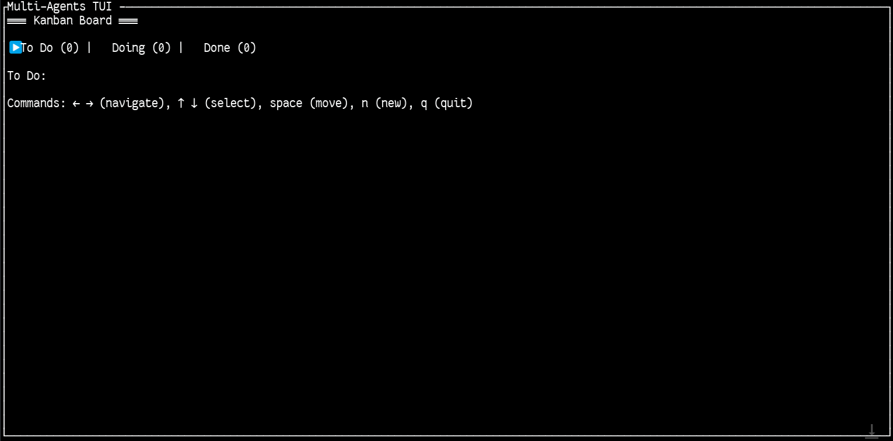

# Multi-Agents CLI Reference

## Environment Requirements
- **OS**: Linux/WSL2 only
- **Required CLIs in PATH**: `gemini`, `claude`, `cursor-agent`, `tmux`, `git`
- **Database**: SQLite at `./data/multi-agents.sqlite3`
- **Logs**: NDJSON format at `./logs/{project}/{role}.ndjson`

## Global Behavior
- **Concurrency**: Maximum 3 one-shot executions (FIFO queue with global semaphore)
- **Default Timeouts**: 
  - `send`: 120s per provider execution
  - `doctor`: 2s per provider check (10s global budget)
  - `tmux actions`: 5s per action (create/attach/stop)
- **Exit Codes**: Standardized across all commands
  - `0`: OK (success)
  - `1`: Generic error
  - `2`: Invalid input (CLI args, malformed config)
  - `3`: Provider unavailable (CLI not found/unusable)
  - `4`: Provider CLI error (non-zero return)
  - `5`: Timeout (operation exceeded limit)
  - `6`: Config missing (YAML files not found)
  - `7`: DB error (SQLite issues)
  - `8`: tmux error (tmux not installed/action failed)
- **References**: 
  - Human-readable spec: [`docs/specs/errors-and-timeouts.md`](specs/errors-and-timeouts.md)
  - Machine-readable defaults: [`config/defaults.yaml`](../config/defaults.yaml)

## Commands

### Environment & Configuration

#### `multi-agents doctor [--format text|json] [--ndjson-sample <path>] [--snapshot <path>]`
Validates environment and required CLIs with comprehensive checks.

**Options:**
- `--format text|json`: Output format (default: text)
- `--ndjson-sample <path>`: Run NDJSON self-check (validates UTF-8, no ANSI, required fields)
- `--snapshot <path>`: Write full JSON report to file (directories created if needed)

**Behavior:**
- Verifies CLIs in PATH: `gemini`, `claude`, `cursor-agent`, `tmux`, `git`
- Checks provider versions and key flags
- Shows progress spinner during checks
- Timeouts: 2s per provider, 10s global

**Exit Codes:**
- `0`: All checks passed
- `1`: Degraded (some flags missing)
- `2`: NDJSON validation failed
- `3`: Required providers missing
- `5`: Timeout during checks

**Examples:**
```bash
# Basic environment check
multi-agents doctor

# JSON output with NDJSON validation
multi-agents doctor --format json --ndjson-sample ./logs/demo/backend.ndjson

# Save full report
multi-agents doctor --snapshot ./doctor-report.json
```

#### `multi-agents config validate [--project-file <path>] [--providers-file <path>]`
Validates YAML configuration files with path resolution.

**Path Resolution Priority:**
1. Command flags (`--project-file`, `--providers-file`)
2. Environment variables (`MULTI_AGENTS_PROJECT_FILE`, `MULTI_AGENTS_PROVIDERS_FILE`, `MULTI_AGENTS_CONFIG_DIR`)
3. Defaults (`./config/project.(yaml|yml)`, `./config/providers.(yaml|yml)`)

**Exit Codes:**
- `0`: Validation successful
- `6`: Config files missing or unreadable

**Examples:**
```bash
# Validate default config files
multi-agents config validate

# Validate specific files
multi-agents config validate --project-file ./my-project.yaml --providers-file ./my-providers.yaml
```

#### `multi-agents config init [--dir <path>] [--force]`
Scaffolds minimal configuration files.

**Options:**
- `--dir <path>`: Target directory (default: `./config`)
- `--force`: Overwrite existing files

**Behavior:**
- Creates minimal `project.yaml` and `providers.yaml`
- Won't overwrite existing files unless `--force`

**Examples:**
```bash
# Create config in default directory
multi-agents config init

# Create in custom directory
multi-agents config init --dir ./my-config

# Force overwrite existing files
multi-agents config init --force
```

### Database Management

#### `multi-agents db init`
Initializes SQLite database with required tables and indexes.

**Behavior:**
- Creates database at `./data/multi-agents.sqlite3`
- Idempotent: safe to run multiple times
- Creates tables: `projects`, `agents`, `sessions`, `messages`, `tasks`, `broadcasts`

**Exit Codes:**
- `0`: Database initialized successfully
- `7`: Database error

**Examples:**
```bash
# Initialize database
multi-agents db init
```

### Project & Agent Management

#### `multi-agents project add --name <name>`
Creates a new project in the database.

**Required Flags:**
- `--name <name>`: Project name (must be unique)

**Exit Codes:**
- `0`: Project created successfully
- `2`: Invalid input (duplicate name, invalid characters)
- `7`: Database error

**Examples:**
```bash
# Create a new project
multi-agents project add --name demo
multi-agents project add --name my-web-app
```

#### `multi-agents agent add --project <name> --name <name> --role <role> --provider <prov> --model <model>`
Creates a new agent in the specified project.

**Required Flags:**
- `--project <name>`: Target project name
- `--name <name>`: Agent name (unique within project)
- `--role <role>`: Agent role (e.g., `backend`, `frontend`, `devops`)
- `--provider <prov>`: Provider (`gemini`, `claude`, `cursor`)
- `--model <model>`: Model name (e.g., `2.0`, `opus`, `gpt-4`)

**Exit Codes:**
- `0`: Agent created successfully (prints created IDs)
- `2`: Invalid input (project not found, duplicate agent name)
- `7`: Database error

**Examples:**
```bash
# Add backend agent
multi-agents agent add --project demo --name backend --role backend --provider gemini --model 2.0

# Add frontend agent
multi-agents agent add --project demo --name frontend --role frontend --provider claude --model opus

# Add devops agent
multi-agents agent add --project demo --name devops --role devops --provider cursor --model gpt-4
```

### Session Management

#### `multi-agents session start --project <name> --agent <name>`
Starts a new conversation session with the specified agent.

**Required Flags:**
- `--project <name>`: Project name
- `--agent <name>`: Agent name

**Output:**
- Prints `conversation_id=<id>` for use with other commands

**Exit Codes:**
- `0`: Session started successfully
- `2`: Invalid input (project/agent not found)
- `3`: Provider unavailable
- `7`: Database error

**Examples:**
```bash
# Start session with backend agent
multi-agents session start --project demo --agent backend
# Output: conversation_id=conv_1234567890abcdef
```

#### `multi-agents session list --project <name> [--agent <name>] [--provider <prov>] [--format text|json]`
Lists sessions for a project with optional filters.

**Options:**
- `--agent <name>`: Filter by agent name
- `--provider <prov>`: Filter by provider
- `--format text|json`: Output format (default: text)

**Behavior:**
- Default filters: `status=active`, `limit=50`, sorted by `created_at DESC`
- Returns: `id`, `provider`, `status`, `created_at`, `last_activity`, `provider_session_id`

**Examples:**
```bash
# List all active sessions
multi-agents session list --project demo

# List sessions for specific agent
multi-agents session list --project demo --agent backend

# JSON output
multi-agents session list --project demo --format json
```

#### `multi-agents session resume --conversation-id <id> [--timeout-ms 5000]`
Resumes an existing conversation session.

**Required Flags:**
- `--conversation-id <id>`: Session ID to resume

**Options:**
- `--timeout-ms <int>`: Timeout in milliseconds (default: 5000)

**Exit Codes:**
- `0`: Session resumed successfully
- `2`: Invalid input (session not found, expired)
- `5`: Timeout

**Examples:**
```bash
# Resume session
multi-agents session resume --conversation-id conv_1234567890abcdef

# Resume with custom timeout
multi-agents session resume --conversation-id conv_1234567890abcdef --timeout-ms 10000
```

#### `multi-agents session cleanup [--project-file <path>] [--dry-run] [--format text|json]`
Cleans up inactive sessions older than 24 hours.

**Options:**
- `--project-file <path>`: Project configuration file
- `--dry-run`: Show what would be deleted without actually deleting
- `--format text|json`: Output format (default: text)

**Behavior:**
- Removes sessions based on `last_activity` or `created_at` > 24h
- Uses same path resolution as `config validate`

**Examples:**
```bash
# Clean up inactive sessions
multi-agents session cleanup

# Dry run to see what would be deleted
multi-agents session cleanup --dry-run

# Clean up with JSON output
multi-agents session cleanup --format json
```

### Messaging

#### `multi-agents send [--project-file <path>] [--providers-file <path>] --to @role|@all|<agent> --message "..." [--timeout-ms <millis>] [--format text|json] [--no-progress]`
Sends a message to one or more agents.

**Required Flags:**
- `--to <target>`: Target (`@role`, `@all`, `<agent>`, or `<conversation_id>`)
- `--message "..."`: Message content

**Options:**
- `--project-file <path>`: Project configuration file
- `--providers-file <path>`: Providers configuration file
- `--timeout-ms <int>`: Override default 120s timeout
- `--format text|json`: Output format (default: text)
- `--no-progress`: Disable progress spinner

**Behavior:**
- Uses same path resolution as `config validate`
- Shows progress spinner by default
- **Cursor headless**: Automatically uses `--output-format stream-json` and parses deltas
- **Sessions**: `--to <conversation_id>` targets existing session; otherwise auto-creates
- Updates `last_activity` and `provider_session_id` when available

**Exit Codes:**
- `0`: Message sent successfully
- `2`: Invalid input
- `3`: Provider unavailable
- `4`: Provider CLI error
- `5`: Timeout
- `6`: Config missing

**Examples:**
```bash
# Send to specific agent
multi-agents send --to backend --message "Implement user authentication"

# Send to all agents in a role
multi-agents send --to @backend --message "Database schema updated"

# Send to all agents
multi-agents send --to @all --message "Starting deployment"

# Send to existing session
multi-agents send --to conv_1234567890abcdef --message "Continue with the previous task"

# Custom timeout and JSON output
multi-agents send --to backend --message "Long running task" --timeout-ms 300000 --format json
```

### Agent REPL Management (tmux)

#### `multi-agents agent run --project <name> --agent <name> [--role <role>] [--provider <prov>] [--model <model>] [--workdir <path>] [--no-logs] [--timeout-ms <int>]`
Creates tmux session/window and starts provider REPL.

**Required Flags:**
- `--project <name>`: Project name
- `--agent <name>`: Agent name

**Options:**
- `--role <role>`: Agent role (optional, from config if not specified)
- `--provider <prov>`: Provider (optional, from config if not specified)
- `--model <model>`: Model (optional, from config if not specified)
- `--workdir <path>`: Working directory (optional)
- `--no-logs`: Disable NDJSON logging
- `--timeout-ms <int>`: Timeout in milliseconds (default: 5000)

**Behavior:**
- Ensures tmux session `proj:{project}` exists
- Creates window `{role}:{agent}` with 1 pane
- Starts provider REPL with system prompt
- If logging enabled, pipes pane to `./logs/{project}/{role}.ndjson` using `pipe-pane -o`
- Emits `start` NDJSON event with agent/provider metadata

**Exit Codes:**
- `0`: Agent started successfully
- `2`: Invalid input (project/agent not found)
- `5`: Timeout
- `8`: tmux error

**Examples:**
```bash
# Start backend agent with default config
multi-agents agent run --project demo --agent backend

# Start with specific provider and model
multi-agents agent run --project demo --agent writer --provider claude --model opus

# Start with custom timeout and working directory
multi-agents agent run --project demo --agent devops --timeout-ms 8000 --workdir /tmp

# Start without logging
multi-agents agent run --project demo --agent backend --no-logs
```

#### `multi-agents agent attach --project <name>`
Attaches current terminal to tmux session.

**Required Flags:**
- `--project <name>`: Project name

**Behavior:**
- Executes `tmux attach -t proj:{project}`
- Prints guidance when run in non-interactive mode

**Exit Codes:**
- `0`: Attached successfully
- `8`: tmux error (session not found)

**Examples:**
```bash
# Attach to project session
multi-agents agent attach --project demo
```

#### `multi-agents agent stop --project <name> --agent <name>`
Stops specific agent REPL by killing its tmux window.

**Required Flags:**
- `--project <name>`: Project name
- `--agent <name>`: Agent name

**Behavior:**
- Executes `tmux kill-window -t proj:{project}:{role}:{agent}`
- Does not kill the session, only the specific window
- Idempotent: returns OK even if window is already missing

**Exit Codes:**
- `0`: Agent stopped successfully (idempotent)
- `8`: tmux error

**Examples:**
```bash
# Stop backend agent
multi-agents agent stop --project demo --agent backend

# Stop multiple agents (run command multiple times)
multi-agents agent stop --project demo --agent frontend
multi-agents agent stop --project demo --agent devops
```

### Broadcast

#### `multi-agents broadcast oneshot [--project-file <path>] [--providers-file <path>] --project <name> --to <targets> --message "..." [--timeout-ms <millis>] [--format text|json] [--progress]`
Sends one-shot message to multiple agents with concurrency control.

**Required Flags:**
- `--project <name>`: Project name
- `--to <targets>`: Target selection (`@all`, `@role`, or comma-separated agent list)
- `--message "..."`: Message content

**Options:**
- `--project-file <path>`: Project configuration file (optional)
- `--providers-file <path>`: Providers configuration file (optional)
- `--timeout-ms <millis>`: Timeout in milliseconds (default: 5000)
- `--format text|json`: Output format (default: text)
- `--progress`: Show progress spinner (default: ON, use --no-progress to disable)

**Behavior:**
- Fan-out to all target agents with concurrency=3
- Persists shared `broadcast_id` for correlation
- Uses same path resolution as `config validate`
- Shows progress spinner by default

**Exit Codes:**
- `0`: Broadcast successful
- `2`: Invalid input (project/agent not found, invalid targets)
- `3`: Provider unavailable
- `4`: Provider CLI error
- `5`: Timeout
- `6`: Config missing
- `7`: Database error

**Examples:**
```bash
# Broadcast to all agents
multi-agents broadcast oneshot --project demo --to @all --message "Starting deployment"

# Broadcast to specific role
multi-agents broadcast oneshot --project demo --to @backend --message "Database schema updated"

# Broadcast to specific agents
multi-agents broadcast oneshot --project demo --to backend,frontend --message "Update config"

# JSON output with custom timeout
multi-agents broadcast oneshot --project demo --to @all --message "Status check" --format json --timeout-ms 10000

# Disable progress spinner
multi-agents broadcast oneshot --project demo --to @all --message "Quick update" --no-progress
```

#### `multi-agents broadcast repl [--project-file <path>] --project <name> --to <targets> --message "..." [--timeout-ms <millis>] [--format text|json] [--progress]`
Sends message to agents in REPL mode using tmux send-keys.

**Required Flags:**
- `--project <name>`: Project name
- `--to <targets>`: Target selection (`@all`, `@role`, or comma-separated agent list)
- `--message "..."`: Message content

**Options:**
- `--project-file <path>`: Project configuration file (optional)
- `--timeout-ms <millis>`: Timeout in milliseconds (default: 5000)
- `--format text|json`: Output format (default: text)
- `--progress`: Show progress spinner (default: ON, use --no-progress to disable)

**Behavior:**
- Sends identical keystrokes to each target tmux window `{role}:{agent}`
- Aggregates per-target status
- Requires tmux sessions to be running
- Uses same path resolution as `config validate`

**Exit Codes:**
- `0`: Broadcast successful
- `2`: Invalid input (project/agent not found, invalid targets)
- `5`: Timeout
- `6`: Config missing
- `7`: Database error
- `8`: tmux error (session not found)

**Examples:**
```bash
# Broadcast to all agents in REPL mode
multi-agents broadcast repl --project demo --to @all --message "Check status"

# Broadcast to specific role in REPL mode
multi-agents broadcast repl --project demo --to @backend --message "Run tests"

# Broadcast to specific agents in REPL mode
multi-agents broadcast repl --project demo --to backend,frontend --message "Update dependencies"

# JSON output with custom timeout
multi-agents broadcast repl --project demo --to @all --message "Status report" --format json --timeout-ms 3000
```

#### Troubleshooting Broadcast

**Common Issues:**

1. **Config files not found (Exit code 6)**
   ```bash
   # Error: project config not found
   # Solution: Initialize configuration first
   multi-agents config init
   multi-agents db init
   multi-agents project add --name demo
   ```

2. **Project/agent not found (Exit code 2)**
   ```bash
   # Error: Project 'demo' not found
   # Solution: Create project and agents
   multi-agents project add --name demo
   multi-agents agent add --project demo --name backend --role backend --provider gemini --model 2.0
   ```

3. **tmux error in REPL mode (Exit code 8)**
   ```bash
   # Error: tmux session not found
   # Solution: Start agents in REPL mode first
   multi-agents agent run --project demo --agent backend
   multi-agents broadcast repl --project demo --to @all --message "Test"
   ```

4. **Provider unavailable (Exit code 3)**
   ```bash
   # Error: Provider CLI not found
   # Solution: Install required CLIs
   multi-agents doctor  # Check what's missing
   ```

5. **Timeout errors (Exit code 5)**
   ```bash
   # Error: Operation timed out
   # Solution: Increase timeout or check provider responsiveness
   multi-agents broadcast oneshot --project demo --to @all --message "Test" --timeout-ms 10000
   ```

**Performance Tips:**
- Use `--no-progress` for faster execution in scripts
- `oneshot` mode is faster for one-time messages
- `repl` mode is better for interactive commands
- Use specific agent names instead of `@all` for better performance

### TUI & Context

#### `multi-agents tui --project <name> [--refresh-rate <millis>]`
Launches terminal user interface.

**Options:**
- `--project <name>`: Project name (defaults to current directory name)
- `--refresh-rate <millis>`: Refresh rate in milliseconds (default: 200)

**Behavior:**
- Kanban board (ToDo/Doing/Done)
- Sessions list and detail views
- NDJSON log tail
- ≤5 Hz refresh rate (configurable via `--refresh-rate`)
- Clean terminal exit and terminal restoration (alt screen, raw mode)
- Ctrl+C exits gracefully

**Keyboard Shortcuts:**
- `q`: Quit
- `Ctrl+C`: Quit (graceful)
- `g` + `T`: Cycle theme (Light → Dark → HighContrast)
- `g` + `M`: Cycle display mode (Normal → Compact → HighDensity)
- `h`: Help state
- `k`: Kanban state
- `s`: Sessions state
- Arrow keys/PageUp/PageDown/Home/End: Navigation in lists/columns
- `Tab` / `Shift+Tab`: Focus navigation
- `Enter`: Select/Activate

**Exit Codes (TUI):**
- `0`: OK
- `1`: Generic error
- `5`: Timeout detected
- `7`: Database error (SQLite)

**Troubleshooting:**
- Terminal not restored properly: rerun any command like `reset` or start TUI again; restoration is handled automatically via RAII guard.
- Slow rendering on large datasets: increase `--refresh-rate` (e.g., `--refresh-rate 300`) to reduce redraw frequency.
- DB errors: initialize DB with `multi-agents db init`; verify file permissions under `./data/`.

**Examples:**
```bash
# Launch TUI for demo project
multi-agents tui --project demo

# Launch TUI with custom refresh rate
multi-agents tui --project demo --refresh-rate 150
```

**Mock Screenshots:**

```text
+--------------------- Multi-Agents TUI | Kanban ---------------------+
|  To Do             |  Doing             |  Done                      |
|  [ ] Task A        |  [*] Task C        |  [x] Task D                |
|  [ ] Task B        |                    |                             |
+---------------------------------------------------------------------+
| gT:Theme gM:Mode  h:Help  k:Kanban  s:Sessions   q/Ctrl+C:Quit       |
+---------------------------------------------------------------------+
```

```text
+-------------------- Multi-Agents TUI | Sessions --------------------+
| id         agent     provider  status     duration                   |
| s_01       backend   claude    running    00:02:31                  |
| s_02       frontend  gemini    completed  00:05:10                  |
+---------------------------------------------------------------------+
| ↑↓/PgUp/PgDn navigate • Enter select • h help • q quit              |
+---------------------------------------------------------------------+
```

**Real Screenshots:**




**Quick Start:**

```bash
# 1) Environment check
multi-agents doctor

# 2) Initialize configuration and database
multi-agents config init
multi-agents db init

# 3) Create project and a couple of agents
multi-agents project add --name demo
multi-agents agent add --project demo --name backend --role backend --provider claude --model claude-3-5-sonnet-20241022 --system-prompt "Backend role"
multi-agents agent add --project demo --name frontend --role frontend --provider gemini --model gemini-1.5-pro --system-prompt "Frontend role"

# 4) Launch the TUI (Dark theme by default, 200ms refresh)
multi-agents tui --project demo

# Tips: press gT to cycle theme, gM to change density, h for help
```

#### `multi-agents context git --status|--diff|--log`
Collects Git context for injection into prompts.

**Options:**
- `--status`: Git status information
- `--diff`: Git diff information  
- `--log`: Git log (last 5 commits)

**Behavior:**
- Collects Git information from current repository
- Respects size limits and redacts secrets when possible
- Used with `send --include-git` flag

**Examples:**
```bash
# Get Git status
multi-agents context git --status

# Get Git diff
multi-agents context git --diff

# Get Git log
multi-agents context git --log
```

## Notes

### Provider Configuration
- Provider flags derive from `providers.yaml` and role allowlists in `project.yaml`
- Use `--verbose` for detailed diagnostics and queue state

### Automatic Synchronization
- YAML → DB sync: At each `send`/`session start`, projects/agents from `project.yaml` are ensured in database (idempotent)

### tmux Conventions
- Session: `proj:{project}`
- Window: `{role}:{agent}`
- 1 pane per agent
- Logs path: `./logs/{project}/{role}.ndjson`

### NDJSON Events for REPL
- `start`: Agent startup with metadata
- `stdout_line`: Each provider stdout line (no ANSI, UTF-8)
- `end`: Termination with `dur_ms` and status

See [`docs/tmux.md`](tmux.md) for detailed tmux conventions and [`docs/workflows.md`](workflows.md) for usage workflows.
